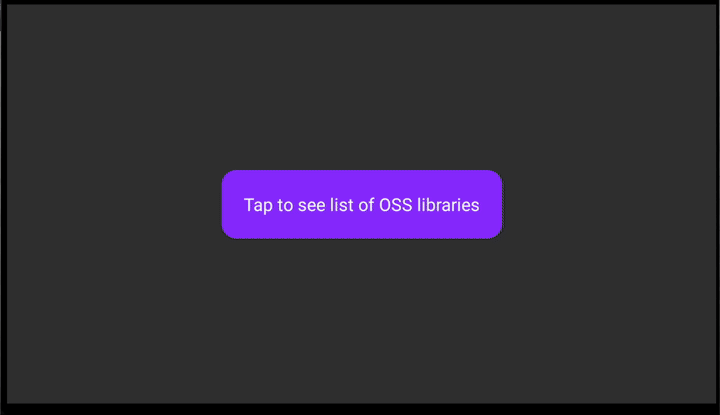

# `react-native-legal`

Automagically generate license acknowledgements for your React Native app 🚀

| Android | iOS | AndroidTV | tvOS |
| - | - | - | - |
|  |  |  |  |

## Installation

```sh
yarn add react-native-legal
```

or

```sh
npm i --save react-native-legal
```

## Usage

This tool is split into 2 parts:
- a library that lets you display native screen with a list of all dependencies and their licenses
- a [config plugin](https://docs.expo.dev/config-plugins/introduction/?redirected) (for Expo projects) and a [custom community cli plugin](https://github.com/react-native-community/cli/blob/main/docs/plugins.md) (for bare RN projects)

### I want to generate licenses in my Expo project <a name="usage-expo"></a>

1. Add the config plugin to the `app.json`/`app.config.js`

```diff
{
  "expo": {
    "plugins": [
+      "react-native-legal"
    ]
  }
}
```

2. Use the library in the codebase

```tsx
import * as React from 'react';
import { Button, View } from 'react-native';
import { ReactNativeLegal } from 'react-native-legal';

function launchNotice() {
  ReactNativeLegal.launchLicenseListScreen('OSS Notice');
}

function MyComponent() {
  return (
    <View>
      <Button onPress={launchNotice} text="Open source licenses" />
    </View>
  );
}
```

3. Use [Prebuild](https://docs.expo.dev/workflow/prebuild/) or [EAS](https://docs.expo.dev/eas/) to build the app

### I want to generate licenses in my bare RN project <a name="usage-bare-rn"></a>

1. Invoke the CLI plugin from the root of your RN app

```sh
npx react-native legal-generate
```

or

```sh
yarn react-native legal-generate
```

2. Use the library in the codebase

```tsx
import * as React from 'react';
import { Button, View } from 'react-native';
import { ReactNativeLegal } from 'react-native-legal';

function launchNotice() {
  ReactNativeLegal.launchLicenseListScreen('OSS Notice');
}

function MyComponent() {
  return (
    <View>
      <Button onPress={launchNotice} text="Open source licenses" />
    </View>
  );
}
```

## Expo

- ✅ You can use this library with [Development Builds](https://docs.expo.dev/development/introduction/) by adding `react-native-legal` to your `app.json`/`app.config.js` plugins array.
- ❌ This library can't be used in the "Expo Go" app because it [requires custom native code](https://docs.expo.dev/workflow/customizing/).

## Contributing

See the [contributing guide](./CONTRIBUTING) to learn how to contribute to the repository and the development workflow.

## Acknowledgements

- [AboutLibraries](https://github.com/mikepenz/AboutLibraries) - collects and displays the license metadata for the Android app <3
- [LicensePlist](https://github.com/mono0926/LicensePlist) - generates license metadata for the iOS app <3

## License

MIT
